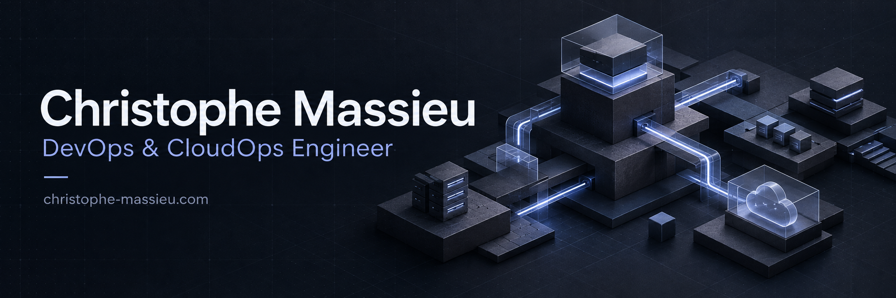

# Christophe Massieu

DevOps & CloudOps Engineer à Bordeaux.

Je rends l'infrastructure fiable, observable et reproductible. Je travaille
sur toute la chaîne, de l'architecture au run : automatisation, plateformes,
livraison, supervision et diagnostic.

[Portfolio](https://christophe-massieu.com/) ·
[LinkedIn](https://www.linkedin.com/in/christophemassieu/)

## Ce que je construis

- des plateformes d'infrastructure reproductibles avec Terraform et Ansible ;
- des chaînes de livraison lisibles et contrôlables ;
- des systèmes d'observabilité orientés diagnostic et action ;
- des outils internes qui réduisent les opérations manuelles ;
- des workflows d'IA agentique avec des sources et des permissions explicites.

## Réalisations publiques

### Consul-Traefik Lab

Un laboratoire local pour expérimenter la découverte de services, le routage
dynamique et l'Infrastructure as Code. Les tests vérifient le trafic, les
métriques, les logs et la détection d'une panne avec retour automatique.

Consul · Traefik · Terraform · Ansible · Prometheus · Grafana · Loki · Alloy

[Voir le laboratoire sur GitHub](https://github.com/nahsiy/consul-traefik-lab)

### Dotfiles

Mes configurations de terminal pour Linux et macOS, avec un installateur
Ansible qui propose un aperçu avant application et sauvegarde les fichiers
remplacés. Tests automatisés pour vérifier l'installation et les protections.

Zsh · tmux · Vim/Neovim · WezTerm · Starship · Ansible

[Voir les dotfiles](https://github.com/nahsiy/Dotfiles)

### Portfolio et Carnet IA

Mon parcours, mes projets et mes retours d'expérience autour de
l'infrastructure et des systèmes agentiques.

[Parcourir le portfolio](https://christophe-massieu.com/) ·
[Lire le Carnet IA](https://christophe-massieu.com/ia/)

## Ma manière de travailler

- Je ne sépare pas la conception de l'exploitation.
- Un déploiement vert ne remplace pas un contrôle fonctionnel.
- Les secrets, les permissions et le retour arrière font partie du design.
- La documentation doit rester utilisable au moment où quelque chose casse.
- L'IA est un levier d'ingénierie, pas une source de vérité.

## Environnement technique

Linux · Docker · Terraform · Ansible · Consul · Vault · Traefik · GitLab CI ·
Jenkins · Grafana · Loki · Alloy · VictoriaMetrics · Prometheus · Python · Bash

Une partie de mon travail vit sur GitLab ou dans des dépôts privés. Ce profil
rassemble les projets et les retours d'expérience que je peux partager.
